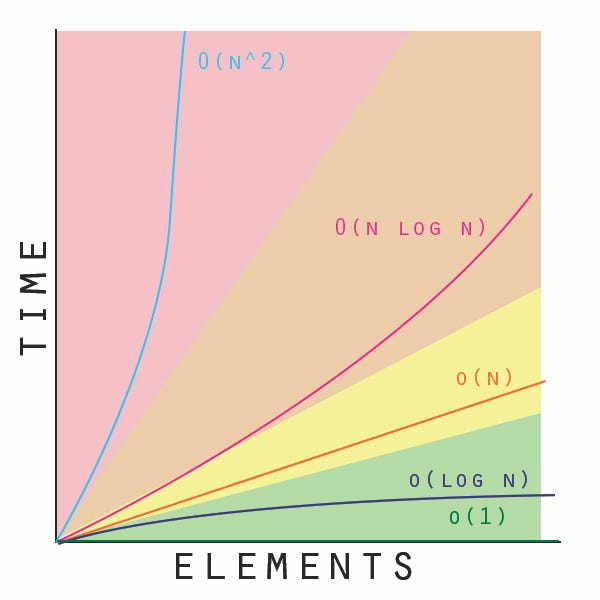

# Complejidad Algoritmica

Permite entender el comportamiento de un algoritmo conforme va incrementando los datos de ingreso

## Eficiencia

__¿Cuándo una solución es eficiente?__
Una solución es eficiente si resuelve el problema dentro de sus limitaciones de recursos

### Formas de medir la eficiencia de un algoritmo

- Espacio (Estructura)
- Tiempo (Algoritmos)
  - __Mejor caso (best case):__ Si es que el input causa que tome el menor tiempo. _**Big Ω**_
  - __Caso promedio (average case):__ Hay que tomar muchos detalles y aplicar algo de estadística para encontrar el tiempo esperado sobre todos los casos posibles del input. _**Big Θ**_
  - __Peor caso (worst case):__ Da una idea del máximo tiempo que un algoritmo puede tomar. _**Big O**_

## Notación Asintótica:

Ver la simplificacion de la taza de crecimiento de complejidad de un algoritmo

### Big O

Es el limite superior, es decir el __peor de los casos__

__¿Qué contar?__

- Operaciones de comparación
- Operaciones aritméticas
- Copiado de datos
- Asignaciones



Cualquier función o linea de codigo se considera Big O(1) __si y solo si:__

- No es un ciclo (bucle)
- No tenga recursión
- Llame a una función que no sea de tiempo constante


|   Orden   |    Nombre    |
| :----------: | :------------: |
|    O(1)    |  constante  |
|    O(n)    |    lineal    |
|   O(n²)   | cuadrática |
|   O(n³)   |   cúbica   |
|   O(a^n)   | exponencial |
|  O(log n)  | logarítmica |
| O(n log n) | casi lineal |

#### Ejemplos

```c++
// <---Función constante O(1)--->

int input;      // O(1) --> asignación

cin>>input;     // O(1) --> asignación

short x = 5;    // 2 == 1 + 1 --> O(1)
                //  |-> short x -> 1 (declaración)
                //  |-> x = 5 -> 1 (asignación)


if(input == x){          // O(1)
    cout<<"Saludo \n";  // O(1)
}

// Donde "c" es una constante que no varia con la entrada
for (short i = 0; i<=c; i++){ // [(1 + 1) + 1 + 1] = 4 --> O(1)
  // Cualquier setencia O(1)
}


```

```c++
// <---Función lineal O(n)--->
// Donde n es la entrada
for(int i = 0; i<=n; i++){ // [(1+1) + n + 1] = 3+n --> O(n)
  // Cualquier setencia O(1)
}

for(int i = n; i>0; i--){ // [(1+n) + n + 1] = 2+2n --> O(n)
  // Cualquier setencia O(1)
}

```

```c++
// <---Función exponencial O(a^n)--->
// Donde n es la entrada

// La complejidad depende de la ejecución del ciclo que está más adentro
// Tambien si todos los ciclos iteran basandose en la entrada

for(int i = 0; i<=n; i++){      // [(1+1) + n + 1] = 3+n
  for(int j = 0; j<=n; j++){    // [(1+1) + n + 1] = 3+n
    //Cualquier setencia O(1)   // |-> (3+n)*(3+n) = 9+6n+n² --> O(n²)

  }
}

for(int i = 0; i<=n; i++){      // [(1+1) + n + 1] = 3+n
  for(int j = 0; j<=n; j++){    // [(1+1) + n + 1] = 3+n
    for(int k = 0; k<=n; k++){  // [(1+1) + n + 1] = 3+n
      //Cualquier setencia O(1) // |-> (3+n)*(3+n)*(3+n) --> O(n³)
    }
  }
}
 // ...Así sucesivamente
```
```c++
// <---Función lineal O(log n)--->
// Donde n es la entrada
for(int i = 0; i<=n; i*=c){ // O(log[n])
  // Cualquier setencia O(1)
}
for(int i = 0; i<=n; i/=c){ // O(log[n])
  // Cualquier setencia O(1)
}
```

```c++
// <---Función lineal O(n log n)--->
// Donde n es la entrada
for(int i = 0; i<=n; pow(i,c)){ // O(log[log[n]])
  // Cualquier setencia O(1)
}
```

#### Ejemplos de clase
##### Regla 1: Sentencias secuenciales

```c++
i = x; // 1 --> una asignación

a = b + 2 * 3; // 3 --> 2 operaciones y una asignación

v[i] = v[0]; // 3 --> 2 accesos a arreglos y una asignación

b = binSearch(v, 10); // 1 + log 10 --> binSearch(v, n): log(n)

cout << b; // 1 --> 1 por cada operador "<<"
```
 - **Tiempo detallado:** 9 + log 10
 - **Tiempo asintótico:** 1, es constante

##### Regla 2: Estructuras repetitivas
```c++
// El for equivale a 1
for (int i = 0; i < n; ++i) { // 1 + n(1 + INTERNA + 2)
sum = sum + A[i]; // 3
cout << sum; // 1
}
```
 > - La inicialización del for cuenta por 1 (asignación).
 > - El número de iteraciones del for __(n en este caso)__ multiplica al valor obtenido enla parte interna del for y se le agrega la expresión correspondiente a la condiciónde finalización (1 en nuestro caso) y la expresión de incremento (2 en nuestrocaso por el operador ++)
 - **Tiempo detallado:** 1 + n(1 + 3 + 1 + 2) = 1 + 7n 
 - **Tiempo asintótico:** O(n), es lineal

##### Regla 3: Repetitivas anidadas
```c++
for (int i = 0; i < n; ++i) { // --> 1 + n(1 + __ + 2)
  for (int k = 0; k < n/2; k += 2) { // --> 1 + (n / 4)(2 + __ + 2)
    cout << i * k; // --> 2
  }
}
```

##### Regla 4: Repetitivas consecutivas
```c++
for (int i=0; i < n; i++){ // --> 1 + n(1 + __ + 2)
  cout << i; // --> 1
    for (int i = 0; i < 10000; ++i) { // --> 1 + 10000(1 + __ + 2)
      for (int k = 1; k < n; k *= 2) { // --> 1 + (log n)(1 + __ + 2)
        cout << i * k; // --> 2
      }
    }
}
```

##### Regla 5: If ... else
```c++
if (a > b){// --> 1 + max(INTERNA IF, INTERNA ELSE)
  a = binSearch(v, b); // --> 1 + log n
} 
else {
  a = v[b]; // --> 2
}
```